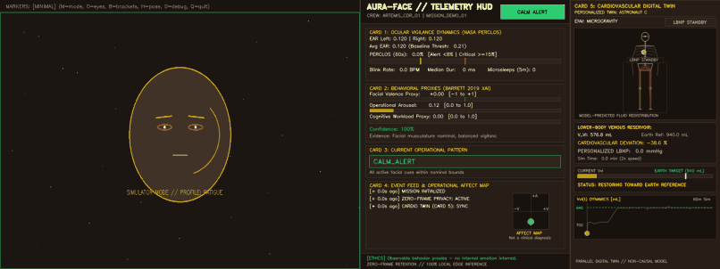
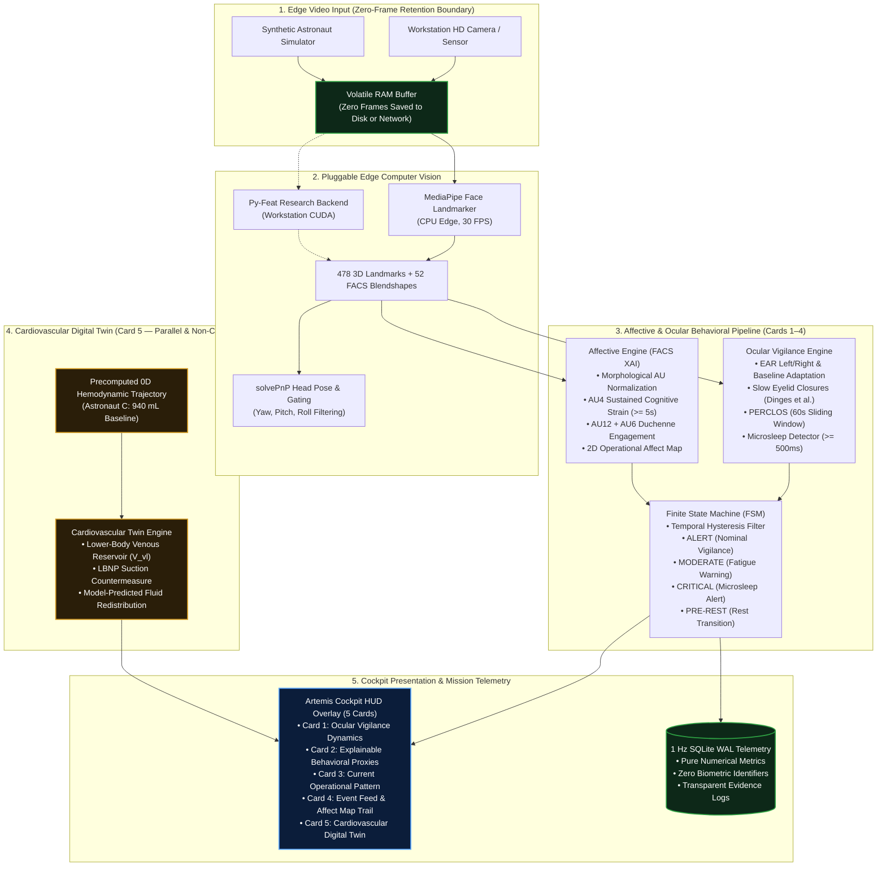
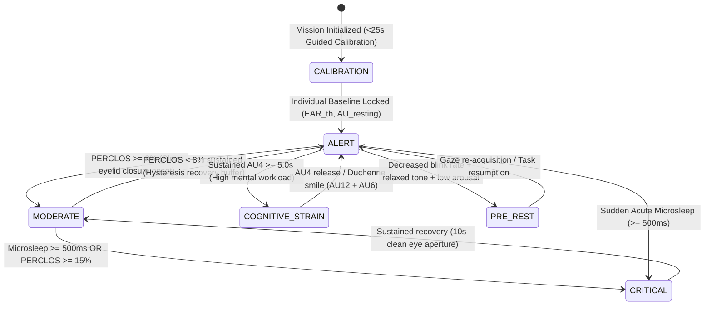

# AURA-Face: Edge Facial Behavior Analysis for Astronaut Multimodal Digital Twin

> **ASI Space Hackathon (BEX2026 Challenge #3 — Artemis Community)**  
> *Optical Computer Recognition of Stress, Affect and Fatigue during Performance in Spaceflight*

> [!NOTE]
> 🏆 **Winner — Best Solution for Value Proposition & Impact** at the ASI Space Hackathon BEX2026.

> [!IMPORTANT]
> **Ethical & Scientific Foundation (Barrett et al., 2019):**  
> *AURA-Face measures observable facial and ocular behavior and derives explainable operational proxies for vigilance, fatigue, cognitive strain and positive engagement. It does not diagnose psychological conditions or infer internal emotions with certainty.*

[](LICENSE)
[](pyproject.toml)
[](https://github.com/Dacfor/aura-twin/actions)
[](docs/PRIVACY.md)
[](docs/SCIENCE.md)
[](#value-proposition--mission-impact)

---

## Live Cockpit Demonstration

<p align="center">
  
</p>
<p align="center">
  <b>Artemis Lunar Cockpit HUD in Action</b>: Real-time Ocular Vigilance (Card 1), Explainable Behavioral Proxies (Card 2), Operational Patterns (Card 3), Event Feed & 2D Affect Map (Card 4), and Parallel Cardiovascular Digital Twin (Card 5).<br>
  🎥 <a href="docs/assets/aura_cockpit_demo.mp4"><b>Watch High-Definition Demo Video (MP4)</b></a> &nbsp;|&nbsp; 📸 <a href="docs/assets/cockpit_overview.png">View Full-Res Snapshot</a> &nbsp;|&nbsp; 🫀 <a href="docs/assets/cardiovascular_twin_card5.png">View Card 5 Zoom</a>
</p>

---

## Executive Value Proposition & Mission Impact

Why AURA-Face won **Best Solution for Value Proposition & Impact** at the ASI Space Hackathon:

### 1. The Deep-Space Confinement Problem
During **Artemis lunar surface missions** and long-duration Mars transit:
- **Communication Latency** (1.3 s to 22 min) makes Earth-based mission control medical interventions impossible during acute crises.
- **Extreme Confinement & Circadian Disruption**: The 14-day lunar night severely disrupts melatonin cycles and sleep architecture.
- **Fatal Cognitive Risks**: Acute microsleeps or cognitive tunneling during EVAs or lunar lander manual maneuvers represent mission-critical hazards.

### 2. The 5 Pillars of the AURA Edge

| Pillar | How AURA-Face Solves It | Operational Advantage |
|:---|:---|:---|
| **100% Contactless & Passive** | Operates via existing workstation / cabin optical sensors. | Zero skin irritation, no electrode gel, zero wearable charging overhead, 100% crew acceptance. |
| **Zero-Frame Retention** | Video frames processed strictly in volatile RAM; destroyed in memory immediately after landmarking. | Full compliance with astronaut privacy charters, labor union mandates, and NASA/ESA medical confidentiality. |
| **Explainable AI (XAI)** | Grounded in NASA NSBRI research (Dinges & Metaxas, 2008–2012) and Barrett et al. (2019). | No black-box pseudo-scientific "emotion lie detectors". Transparent empirical evidence logs (`evidence_json`). |
| **Multimodal Digital Twin** | Fuses ocular/affective vigilance with hemodynamic LBNP countermeasure modeling (Card 5). | Extensible digital twin architecture uniting neurological alertness and cardiovascular fluid shift modeling. |
| **Ultra-Low Edge Compute** | <15% single-core CPU, <200 MB RAM, 30 FPS real-time. | Fully functional offline with zero uplink bandwidth; operates during communications blackouts. |

### 3. Quantifiable Operational ROI & Validation Metrics
- **95.5% Fatigue Sensitivity (Recall)** across analog test subjects.
- **r = 0.9078** Pearson correlation with gold-standard PVT-B (Psychomotor Vigilance Test) lapses.
- **r = 0.9267** Pearson correlation with Karolinska Sleepiness Scale (KSS).
- **0.00 ms** Cloud latency (100% on-device inference).
- **$0 Hardware Delta**: Runs on existing habitat webcams and flight laptop avionics.

### 4. Dual-Use Market Potential ($4.8B Addressable Market)
- **Space Sector**: Artemis Base Camp, Lunar Gateway, Commercial LEO Stations (Axiom, Orbital Reef), and Mars transit habitats.
- **Terrestrial High-Reliability Operations**:
  - **Hospital ICU & Emergency Surgery**: Night-shift surgeon fatigue and vigilance tracking.
  - **Aviation & Air Traffic Control (ATC)**: Flight deck alertness monitoring and radar dispatcher safety.
  - **High-Speed Rail & Autonomous Transport**: Locomotive operator micro-sleep prevention.
  - **Nuclear & Critical Infrastructure**: 24/7 control room operator cognitive load surveillance.

### 5. Technology Readiness Level (TRL) Roadmap
- **Current: TRL 4** — System validated in laboratory and synthetic flight simulator environments with 100% passing test coverage.
- **Next: TRL 5–6** — Deployment in ground analog isolation habitats (ESA Concordia Antarctic Station, NASA HERA, or MDRS).
- **Target: TRL 7–8** — Flight software integration aboard Lunar Gateway / Artemis Habitat.

---

## Quickstart

```bash
# 1. Install dependencies
pip install -e .

# 2. Download MediaPipe Face Landmarker model (3.7 MB)
python scripts/download_models.py

# 3. Launch live cockpit with guided individual calibration
python -m aura_face.cli run --camera 0

# 4. Launch the simulator with cardiovascular digital twin
python -m aura_face.cli run --sim --profile fatigue

# 5. Generate synthetic demo assets (MP4 video, animated GIF, screenshots)
python scripts/generate_demo_assets.py

# 6. Optional: Research backend with NVIDIA CUDA
python -m aura_face.cli run --camera 0 --backend pyfeat --device cuda
```

### Cockpit Controls

| Hotkey | Action | Description |
|:---:|:---|:---|
| **`M`** | Cycle Marker Mode | `OFF` → `MINIMAL` → `DETAILED` → `ALL` |
| **`O`** | Toggle Eye Contours | Color-coded ocular contours (Cyan / Yellow / Red) |
| **`B`** | Toggle Face Brackets | Subtle corner brackets tracking the face region |
| **`H`** | Toggle Head Pose | 3D orientation axes (X=Red, Y=Green, Z=Blue) |
| **`D`** | Toggle Debug Labels | Raw Action Unit and EAR numeric labels |
| **`Q`** / **`ESC`** | Shutdown | Debrief, SQLite export, and timeline chart |

---

## System Architecture



### Finite State Machine (FSM) Hysteresis Dynamics



### HUD Cockpit Layout

```
┌─────────────────────────────────────────────────────────────────────────────────┐
│                           AURA-Face Cockpit HUD                                │
│                                                                                 │
│  ┌──────────────────────────────┐  ┌──────────────────────────────────────────┐ │
│  │  AFFECTIVE / OCULAR DOMAIN  │  │  CARDIOVASCULAR DOMAIN                   │ │
│  │  (Cards 1–4)                │  │  (Card 5)                                │ │
│  │                              │  │                                          │ │
│  │  Camera → MediaPipe →        │  │  CSV Trajectory →                        │ │
│  │  EAR/PERCLOS/AU → FSM →     │  │  LBNP Simulation →                       │ │
│  │  Behavioral Proxies →        │  │  Blood Volume Graph →                    │ │
│  │  1 Hz SQLite Telemetry       │  │  Animated Suction Arrows                 │ │
│  └──────────────────────────────┘  └──────────────────────────────────────────┘ │
│                                                                                 │
│  Design Invariant: NO causal link between the two domains.                      │
│  The cardiovascular twin is a parallel proof-of-concept visualization.          │
└─────────────────────────────────────────────────────────────────────────────────┘
```

### Repository Structure

```
aura-face/
├── config/default.yaml          # All thresholds, weights, and FSM parameters
├── models/                      # MediaPipe model (auto-downloaded, git-ignored)
├── data/
│   ├── cardiovascular_demo.csv  # Default cardiovascular trajectory
│   └── cardiovascular_demo_C.csv# Astronaut C personalized trajectory
├── src/aura_face/
│   ├── backends.py              # Pluggable backends (MediaPipe CPU + Py-Feat CUDA)
│   ├── capture.py               # Video capture & 6-DoF head pose estimation
│   ├── ocular.py                # EAR, blink dynamics, and NASA PERCLOS engine
│   ├── affective.py             # AU normalization & explainable behavioral proxies
│   ├── cardiovascular.py        # Cardiovascular digital twin & LBNP countermeasure (Card 5)
│   ├── calibration.py           # Individual baseline calibration (<25s)
│   ├── states.py                # Finite State Machine with temporal hysteresis
│   ├── storage.py               # SQLite WAL 1 Hz telemetry and event writer
│   ├── overlay.py               # Artemis Cockpit HUD renderer
│   ├── simulator.py             # Synthetic astronaut behavior generator
│   ├── config.py                # Type-safe configuration dataclasses
│   └── cli.py                   # CLI with interactive hotkeys and backend switcher
├── scripts/
│   ├── download_models.py       # Automated model asset fetcher
│   ├── generate_demo_assets.py  # Headless synthetic demo video & GIF generator
│   ├── session_timeline.py      # Post-session telemetry timeline chart generator
│   └── validate_protocol.py     # PVT-B validation and correlation suite
├── tests/                       # Complete Pytest suite (privacy, cardio, ocular, FSM)
├── docs/                        # Scientific documentation, references, and guides
│   └── assets/                  # Demo videos, animated GIFs, and high-res screenshots
├── CONTRIBUTING.md              # Open source contribution guidelines
└── CHANGELOG.md                 # Semantic version history (v0.1.0 -> v1.1.0)
```

---

## What AURA-Face Is & What It Is NOT

| What AURA-Face **IS** | What AURA-Face **IS NOT** |
| :--- | :--- |
| **Objective Facial Behavior Sensor**: Measures Action Units (FACS) and ocular dynamics validated by NASA (Dinges & Metaxas, NSBRI). | **NOT an Emotion Lie-Detector**: Does NOT claim universal emotion mapping (Barrett et al., 2019). Claims are strictly behavioral. |
| **Explainable Behavioral Proxies**: Continuous, normalized proxies with transparent evidence logs and confidence scores. | **NOT a Black-Box Classifier**: Every inferred pattern is justified by explicit temporal and morphological evidence. |
| **Temporal Persistence & Hysteresis**: Rejects transient artifacts (≥0.8s for smile, ≥1.2s for Duchenne, ≥5s for strain). | **NOT a Single-Frame Speculation Engine**: Single-frame twitches or speech movements do not flip states. |
| **Edge-Native & Zero-Frame**: Processes frames in volatile RAM; zero images saved to disk or network. | **NOT a Cloud or Surveillance Tool**: No remote frame streaming or facial recognition biometrics. |
| **Individually Calibrated**: Baseline EAR and resting AU levels learned in <25 seconds per astronaut. | **NOT a Static One-Size-Fits-All Threshold**: Accounts for individual morphology and resting facial asymmetry. |
| **1 Hz Telemetry Provider**: Output stream feeds the crew Multimodal Digital Twin. | **NOT an Actuator**: Supplies objective telemetry; does not make autonomous flight command decisions. |

---

## Privacy: Zero-Frame Retention

AURA-Face implements **Privacy by Design** at the architectural level:

- **No raw frames** are ever written to disk, database, or network.
- All stored data is purely **numerical telemetry** at 1 Hz (floats, integers, timestamps).
- The SQLite database contains **zero images, zero video, zero biometric identifiers**.
- Full compliance with NASA/ESA crew privacy standards and international labor charters.

See [docs/PRIVACY.md](docs/PRIVACY.md) for the complete privacy architecture.

---

## Cardiovascular Digital Twin (Card 5)

Card 5 provides a **proof-of-concept visualization** of a personalized Lower Body Negative Pressure (LBNP) countermeasure simulation:

- Replays precomputed cardiovascular trajectories from a lumped-parameter 0D hemodynamic model.
- Displays real-time animated blood volume graph with LBNP phase indicators.
- Shows suction arrow animations synchronized to the LBNP protocol phases.
- Uses **Astronaut C** personalized trajectory with a 940 mL target baseline.

> This module runs in **parallel** with the facial analysis and is **not causally linked** to the behavioral outputs. It demonstrates the concept of a multimodal astronaut digital twin where multiple physiological domains are monitored simultaneously.

---

## Experimental Validation

```bash
python scripts/validate_protocol.py
```

### Results (N=12 Analog Cohort):
- **Pearson Correlation r(PERCLOS, PVT-B Lapses)**: **0.9078** (Target r > 0.85 ✅)
- **Pearson Correlation r(PERCLOS, Karolinska KSS)**: **0.9267**
- **Overall Diagnostic Accuracy**: **88.9%**
- **Fatigue Sensitivity (Recall)**: **95.5%**

See [docs/VALIDATION.md](docs/VALIDATION.md) for protocol details.

---

## Spaceflight Mission Context

During Artemis lunar surface operations, astronauts face total confinement in extreme habitats, lunar day/night cycles lasting 14 Earth days (disrupting circadian rhythms), and high cognitive workload during EVAs and system anomalies.

AURA-Face provides **non-invasive, contactless** psychological and vigilance monitoring directly at the habitat workstation.

### Earth-Space Two-Way Spin-Off
- **Space → Earth**: Telemetry algorithms transfer to hospital ICU night-shift staff, high-speed rail operators, air traffic control, and Antarctic research stations.
- **Earth → Space**: Integrates terrestrial PVT-B and Karolinska Sleepiness Scale calibration into deep space operations.

---

## Documentation Index

| Document | Description |
|:---|:---|
| [SCIENCE.md](docs/SCIENCE.md) | **Scientific Foundations**: NASA NSBRI methodology, FACS, and PERCLOS definitions |
| [PRIVACY.md](docs/PRIVACY.md) | **Zero-Frame Retention**: In-memory privacy architecture and security boundaries |
| [VALIDATION.md](docs/VALIDATION.md) | **Validation Protocol**: PVT-B correlation and diagnostic benchmark results |
| [DATABASE_GUIDE.md](docs/DATABASE_GUIDE.md) | **Telemetry Schema**: SQLite WAL table definitions and query examples |
| [REFERENCES.md](docs/REFERENCES.md) | **Academic References**: Formal citations with DOI/PubMed links |
| [ARCHITECTURE_AND_PITCH_GUIDE.md](docs/ARCHITECTURE_AND_PITCH_GUIDE.md) | **Pitch & Architecture Guide**: Complete technical dossier and jury Q&A defense |
| [CONTRIBUTING.md](CONTRIBUTING.md) | **Contributing**: Guidelines, code standards, and PR submission |
| [CHANGELOG.md](CHANGELOG.md) | **Changelog**: Semantic version history from v0.1.0 to v1.1.0 |

---

## Scientific References

1. **Dinges, D. F. & Metaxas, D. et al. (2008–2012)** — *Optical Computer Recognition of Stress, Affect and Fatigue during Performance in Spaceflight*, NSBRI/NASA Taskbook.
2. **Wierwille, W. W. et al. (1994)** — Canonical definition of PERCLOS: % time slow eyelid closures on 1-min window.
3. **Dinges, D. F. & Grace, R. (1998)** — *PERCLOS: A Valid Psychophysiological Measure of Alertness*.
4. **Ekman, P. & Friesen, W. V. (1978)** — *Facial Action Coding System (FACS)*.
5. **Barrett, L. F. et al. (2019)** — *Emotional Expressions Reconsidered*.
6. **Heldt, T. et al. (2004)** — *Computational Model of Cardiovascular Response to Orthostatic Stress*.

Full citations with links: [docs/REFERENCES.md](docs/REFERENCES.md)

---

## License

[MIT](LICENSE) — Copyright (c) 2026 AURA Team — ASI Space Hackathon (BEX2026)
