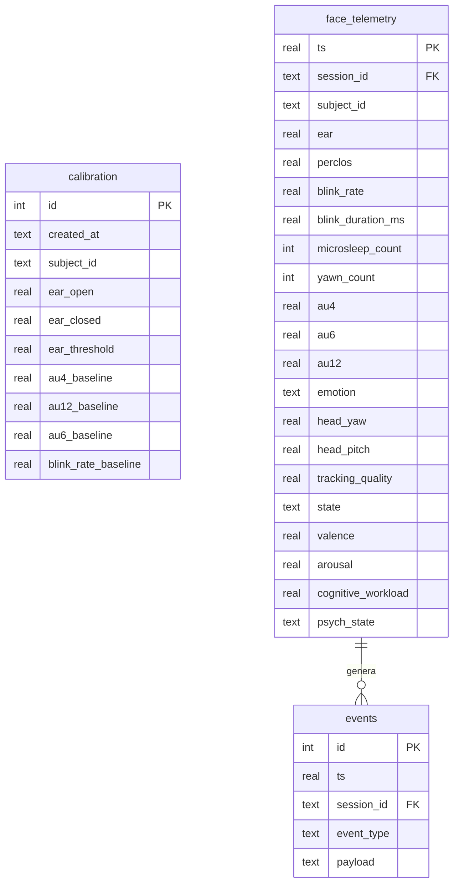

# Guida all'Interpretazione dei Dati di Telemetria (SQLite)

Il database locale di **AURA-Face** è memorizzato in SQLite con modalità **WAL (Write-Ahead Logging)** in `data/aura_face_telemetry.db`.
Tutti i dati vengono campionati ed elaborati a **1 Hz** per la telemetria continua, mentre gli eventi discreti (microsleep, sbadigli, transizioni di stato) vengono loggati istantaneamente su occorrenza.

---

## 1. Architettura delle Tabelle

Il database contiene tre tabelle relazionali:
1. `calibration`: Conserva i valori di baseline individuali dell'astronauta determinati nei primi 20-25 secondi di calibrazione.
2. `face_telemetry`: Serie temporale a 1 Hz di tutti i parametri oculari, dimensionali affettivi e di stato FSM.
3. `events`: Registro degli eventi discreti con timestamp e payload JSON strutturato.



---

## 2. Dizionario dei Dati: `face_telemetry`

| Colonna | Tipo | Range Tipico | Significato Psicofisiologico | Range Nominale | Soglia Allerta / Intervento |
|---|---|---|---|---|---|
| `ts` | REAL | UNIX time (s) | Timestamp preciso dell'osservazione | Monotono crescente | Non applicabile |
| `session_id` | TEXT | `SESSION_*` | Identificativo univoco della sessione | Stringa fissa | Non applicabile |
| `subject_id` | TEXT | es. `artemis_cdr_01` | Identificativo dell'astronauta | Stringa fissa | Non applicabile |
| `ear` | REAL | `0.05` - `0.45` | Eye Aspect Ratio (apertura oculare levigata $\alpha=0.6$) | $\ge \text{Baseline} \times 0.8$ | $< \text{Soglia Calibrata}$ (occhi chiusi) |
| `perclos` | REAL | `0.0%` - `100.0%` | % tempo rima oculare $<20\%$ su finestra 60s (Wierwille 1994) | $< 8.0\%$ | **$\ge 8.0\%$**: MODERATE<br>**$\ge 15.0\%$**: CRITICAL |
| `blink_rate` | REAL | `5.0` - `35.0` BPM | Frequenza di ammiccamento su finestra 60s | $12 - 22$ BPM | $< 8$ BPM (carico visivo estremo)<br>$> 28$ BPM (affaticamento oculare iniziale) |
| `blink_duration_ms`| REAL | `80` - `600` ms | Mediana durata ammiccamenti (finestra 60s) | $100 - 250$ ms | $> 350$ ms (ammiccamenti lenti / "droops") |
| `microsleep_count` | INTEGER | $0$ - $N$ | Numero di microsonni ($>500$ ms) negli ultimi 5 minuti | $0$ | $\ge 1$ (**CRITICAL immediato**) |
| `yawn_count` | INTEGER | $0$ - $N$ | Conteggio cumulativo sbadigli (apertura mandibola $>2$ s) | $0 - 2$ / ora | $\ge 3$ in 10 min (segno precoce ipovigilanza) |
| `au4` | REAL | `0.0` - `1.0` | Brow Lowerer normalizzato su baseline (Dinges 2005) | $< 0.25$ | $> 0.50$ sostenuto per $>5$ s (sforzo/frustrazione) |
| `au6` | REAL | `0.0` - `1.0` | Cheek Raiser normalizzato (orbicolare dell'occhio) | Non critico | Se attivo con AU12: Duchenne (sorriso autentico) |
| `au12` | REAL | `0.0` - `1.0` | Lip Corner Puller (grande zigomatico, sorriso) | Non critico | Indicatore primario di valenza positiva |
| `emotion` | TEXT | Categorie EMFACS | Stato prototipale (Neutral, Happiness, Anger/Stress...) | `Neutral` / `Happiness` | `Anger/Stress` prolungato |
| `head_yaw` | REAL | gradi | Rotazione orizzontale del capo | $[-15^\circ, +15^\circ]$ | $|yaw| > 25^\circ$ (gating out: telemetria sospesa) |
| `head_pitch` | REAL | gradi | Inclinazione verticale del capo | $[-12^\circ, +12^\circ]$ | $|pitch| > 20^\circ$ (gating out) |
| `tracking_quality` | REAL | `0.0` - `1.0` | Confidenza del fit 3D MediaPipe | $> 0.85$ | $< 0.50$ (illuminazione scarsa o viso parziale) |
| `state` | TEXT | Enum 5 stati | Stato FSM: `ALERT`, `MODERATE`, `CRITICAL`, `PRE_REST`, `UNKNOWN` | `ALERT` | `MODERATE` / `CRITICAL` |
| `valence` | REAL | `-1.0` a `+1.0` | Valenza edonica (Russell Circumplex) | $[0.0, +0.6]$ | $< -0.30$ (affetto negativo/frustrazione) |
| `arousal` | REAL | `0.0` a `1.0` | Attivazione psicofisiologica (Russell Circumplex) | $[0.30, 0.70]$ | $< 0.18$ (ipovigilanza/letargia)<br>$> 0.85$ (iper-arousal/panico) |
| `cognitive_workload`| REAL | `0.0` a `1.0` | Indice di carico cognitivo (Dinges 2005; Schleicher 2008) | $[0.10, 0.45]$ | $> 0.65$ (sovraccarico mentale, rischio errori) |
| `psych_state` | TEXT | Enum 7 stati | Stato psicologico operativo (Barrett 2019; Russell 1980) | `Calm Alert`, `Focused Flow` | `Cognitive Strain`, `Drowsiness Impairment` |

---

## 3. Dizionario degli Stati Psicologici Operativi (`psych_state`)

1. **`Calm Alert`**: Condizione nominale di riposo vigile. Valenza bilanciata, arousal medio ($0.3 - 0.5$), PERCLOS $< 8\%$.
2. **`Focused Flow`**: Concentrazione operativa profonda su compiti complessi (docking, EVA, checklist critiche). AU4 moderato, inibizione fisiologica del blink ($< 10$ BPM), valenza non negativa, PERCLOS nullo.
3. **`Cognitive Strain`**: Sovraccarico cognitivo acuto o frustrazione operativa (Dinges & Metaxas 2005). AU4 elevato e sostenuto ($>5$ s), valenza negativa ($<-0.15$), frequente tensione perioculare.
4. **`Genuine Engagement`**: Morale elevato e benessere psicologico. Sorriso di Duchenne autentico (co-attivazione simultanea di AU12 + AU6, Ekman 1978).
5. **`Drowsiness Impairment`**: Compromissione severa della vigilanza da deprivazione di sonno o calo circadiano. PERCLOS $\ge 8-10\%$, durata blink $>350$ ms, ammiccamenti lenti ("droops"), microsleeps.
6. **`Hypovigilance`**: Ipovigilanza e noia da sotto-stimolazione. Arousal molto basso ($<0.18$), sguardo fisso non variato, assenza di mimica facciale attiva.
7. **`Isolation Exhaustion`**: Quadro di affaticamento cumulativo da isolamento prolungato (analogo Mars-500). Pattern pre-rest attivo (AU4 prolungato $>3$ minuti senza sorriso) combinato a calo graduale della valenza.

---

## 4. Query SQL Diagnostiche Pronte all'Uso

### A. Calcolo del Profilo di Fatica Globale della Sessione
```sql
SELECT 
    session_id,
    subject_id,
    ROUND(AVG(perclos), 2) AS mean_perclos,
    ROUND(MAX(perclos), 2) AS peak_perclos,
    ROUND(AVG(cognitive_workload), 2) AS mean_workload,
    ROUND(AVG(valence), 2) AS mean_valence,
    SUM(CASE WHEN state = 'CRITICAL' THEN 1 ELSE 0 END) AS seconds_critical,
    SUM(CASE WHEN state = 'MODERATE' THEN 1 ELSE 0 END) AS seconds_moderate,
    SUM(CASE WHEN state = 'ALERT' THEN 1 ELSE 0 END) AS seconds_alert
FROM face_telemetry
GROUP BY session_id;
```

### B. Elenco Cronologico dei Microsleep e Anomalie Critiche
```sql
SELECT 
    datetime(ts, 'unixepoch', 'localtime') AS local_time,
    event_type,
    payload
FROM events
WHERE event_type IN ('MICRO_SLEEP', 'STATE_CHANGE', 'COGNITIVE_LOAD_ONSET')
ORDER BY ts ASC;
```

### C. Analisi degli Episodi di Sovraccarico Cognitivo vs Vigilanza
```sql
SELECT 
    ts,
    psych_state,
    ROUND(cognitive_workload, 2) AS workload,
    ROUND(au4, 2) AS au4_brow,
    ROUND(blink_rate, 1) AS bpm,
    ROUND(valence, 2) AS valence
FROM face_telemetry
WHERE cognitive_workload > 0.50
ORDER BY ts ASC;
```
